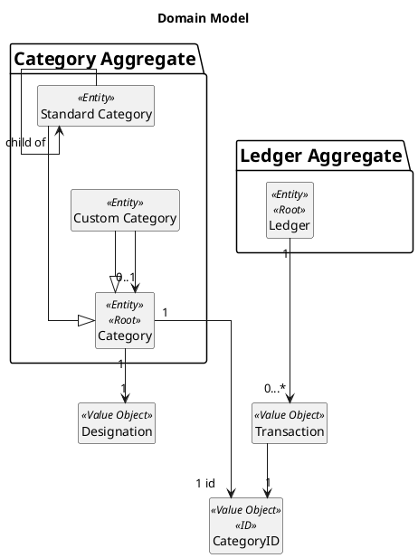
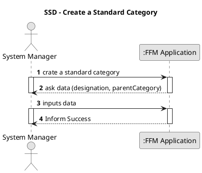
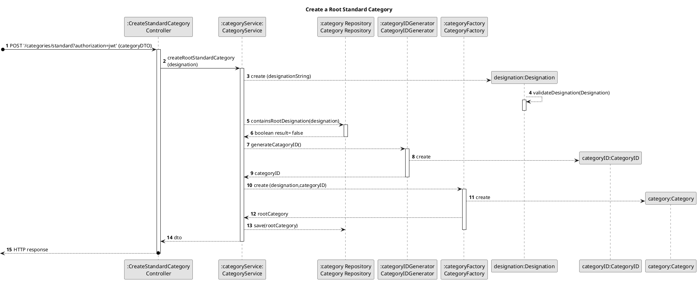
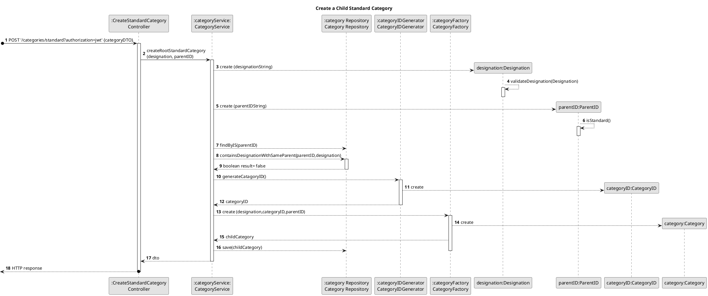
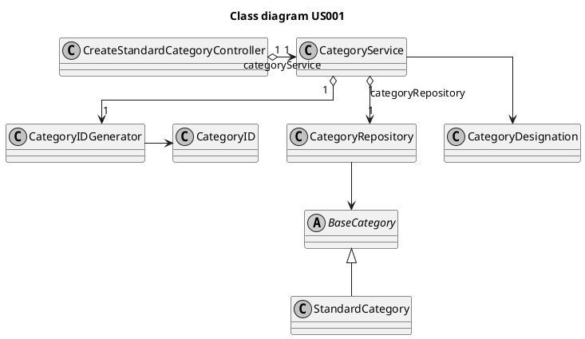

# US001
=======================================

# 1. Requirements

>__"As a system manager, I want to create a standard category."__

**Demo1** As a System Manager, I want to create a standard category and add it to the system

- Demo1.1. Create a Standard Root Category

- Demo1.2. Create a Child Standard Category

This requirement was interpreted as a direct possibility for the system manager to create a new 
standard root category , introducing the desired name as an argument or as a possibility to create
a new child standard category, selecting the parent category along with the desired designation.

# 2. Analysis
##2.1 Domain Model Context

## 2.2 Product Owner

Some questions to the product owner (PO) were asked in order to make some important design decisions.

> Q: What is the expected to happen when the system manager tries to insert an already existing category name?

> A: It should not be possible to insert an already existing category

> Q: What is the expected to happen when the system manager adds "energy" and "Energy" ? Are they
> considered to be the same category?

> A: "Energy" and "energy" should be the same category. Forcing the categories to have the same format seems positive
> (i.e, all capitalized letters, all lower case characters or having only the first letter capitalizes )

> Q: Should the System Manager be allowed to add new standard categories after the application has reached the user?
> If so, should all the families receive an update, or should only the new families receive it?

> A: The System Manager can change the names throughout the time and all the families should receive the update. 
> The resulting problem (a new standard category having the same designation as a subcategory) ,can easily be
> solved by making telling apart the standard categories from the custom ones possible.

## 2.3 Decisions

-It was decided that the root categories name's must be unique. In the same tree, categories at the same level
cannot have the same name. Parent and child categories are also restricted from taking the same name.

-It was decided that the categories can have more than one word and that every first letter
would be capitalized. Special characters, in general, are not allowed except for apostrophes and
accents, commonly used in the portuguese and english languages.

-It was decided to correct certain typing mistakes such as the spacing between characters
when the system administrator types the standard  category name but no spelling corrections were applied

-It was assumed that a standard category does not have a length inferior to 3 characters

## 2.4. US Dependencies

This User Story does not depend on other User Stories. However, US002 depends on this US.

## System Sequence Diagram

# 3. Design

## 3.1. Functionalities Flow

The sequence diagram above represents the process of creating a standard root category.
The system manager must introduce the desired category name in the UI as input, and must not select a parent category.
The application can answer in one of two ways:
-inform success if the category is successfully created and is added to the system
-inform failure if the standard category's addition to the system fails.
This sequence diagram represents only the first option, where the standard category is successfully
created and added to the system.
The reasons as to why the process can fail are the following:
- The System Manager introduces an invalid designation (for example an empty designation)
- The designation introduced is already in use by another root designation
- The category's Id is already in use

The sequence diagram above represents the process of creating a standard child category.
The system manager must introduce the desired category name in the UI as input, and must point out which category is the
parent category.
The application can answer in one of two ways:
-inform success if the category is successfully created and is added to the system
-inform failure if the standard category's addition to the system fails.
This sequence diagram represents only the first option, where the child standard category is successfully
created and added to the system.
The reasons as to why the process can fail are the following:
- The System Manager introduces an invalid designation (for example an empty designation)
- The parent ID introduced corresponds to a parent category that is not standard. the system manager
  should only be able to add child categories to a standard parent category.
- The designation introduced is already in use by another child at the same level
- The category's ID is already in use

## 3.2. Class Diagram

## 3.3. Applied Design Patterns

From GRASP pattern:
Controller,
Information Expert,
Low Coupling

From SOLID:
Single Responsibility Principle

## 3.4. Tests 

**Test 1:** Create one root standard category successfully

    @Test
    void createStandardCategory() {
        //arrange
        String designation = "Abacaxi";
        CategoryInDTO info = new CategoryInDTO();
        info.setDesignation(designation);
        //act
        ResponseEntity<Object> result = controller.createStandardCategory(info);
        //assert
        assertEquals(201, result.getStatusCodeValue());

    }
**Test 2:** Create one child standard category successfully

    @Test
    void createStandardChildCategory() throws DesignationNotPossibleException {
    //arrange
    //create parentCategory
    String designationParent = "food";
    StandardCategoryOutDTO outparent = categoryService.createRootStandardCategory(designationParent);
    String parentID = outparent.getId();

    //create childCategory
    String designationChild = "Abacaxi";
    CategoryInDTO info = new CategoryInDTO();
    info.setDesignation(designationChild);
    info.setParentID(parentID);

    //act
    ResponseEntity<Object> result = controller.createStandardCategory(info);

    //assert
    assertEquals(201, result.getStatusCodeValue());
    }

**Test 2:** Failure case: Invalid designation
    
    @Test
    void createStandardCategoryFailure() throws DesignationNotPossibleException, ElementNotFoundException {
        //arrange
        //create parentCategory
        String designationParent = "Abacaxi";
        StandardCategoryOutDTO outparent = categoryService.createRootStandardCategory(designationParent);
        String parentID = outparent.getId();

        //create childCategory
        String designationChild = "Abacaxi";
        CategoryInDTO info = new CategoryInDTO();
        info.setDesignation(designationChild);
        info.setParentID(parentID);
        categoryService.createChildStandardCategory(designationParent, parentID);

        //act
        ResponseEntity<Object> result = controller.createStandardCategory(info);

        //assert
        assertEquals(400, result.getStatusCodeValue());
    }

# 4. Implementation

public StandardCategoryOutDTO createChildStandardCategory(String designation, String parentID) throws ElementNotFoundException, DesignationNotPossibleException {
Designation parseCategoryDesignation = new CategoryDesignation(designation);
CategoryID parentCategoryID = new CategoryID(parentID);
Category parentCategory = categoryRepository.findByID(parentCategoryID);
if (parentCategory.isStandard() && categoryRepository.containsDesignationWithSameParent(parentCategoryID, parseCategoryDesignation)) {
throw new DesignationNotPossibleException();
}
CategoryID categoryID = categoryIDGenerator.generate();
Category childCategory = CategoryFactory.create(parseCategoryDesignation, categoryID, parentCategoryID);
Category responseChildCategory = categoryRepository.save(childCategory);
return new StandardCategoryOutDTO(responseChildCategory.getDesignation().toString(), responseChildCategory.getID().toString(), responseChildCategory.getParentID().toString());
}

At first, a category is created. There are some criteria that, if not met, can stop the
whole process.  For example, the category name has to have a certain format:
-has a minimum of letters
-cannot contain special characters
- the first letters of each word must be capitalized
  -must be filled.
  -must not have the same name as other categories

If any of these validations is not respected the new category will not be created, and the process will 
finish. as a result, the system manager will be informed that the process was not successful.
Due to the fact that there cannot be different categories with the same name, a category
identification (id) is not created, since their name is unique..

    public static String capitalizeFirstLetters(String categoryDesignation) {
    categoryDesignation = categoryDesignation.trim().toLowerCase();   //deletes space characters at the end and at the beginning of a Sting
    while (categoryDesignation.contains("  ")) { // deletes multiple space characters
    categoryDesignation = categoryDesignation.replaceAll("  ", " ");
    }
    String[] split = categoryDesignation.split(" ");
    for (int i = 0; i < split.length; i++) {
    split[i] = Character.toUpperCase(split[i].charAt(0)) + split[i].substring(1);
    }
    categoryDesignation = String.join(" ", split);
    return categoryDesignation;
    }

The code above was designed to help the user, in this case, it helps the system
manager to correct some typing errors:

-If the user capitalizes the wrong letters

-If the user inserts spacing characters at the beginning or a the end of a phrase

-If the user inserts multiple adjacent spacing characters

This portion was first designed for this specific US but, later on 
was moved to the Class Utils so that it can be used to format other
Strings such as the address or the family name.
This portion helps correct some typos and, in this US, it is later on combined with other
piece of code that guarantees that the category name only has alphabetic
characters (capitalized or not), space characters, apostrophes and accents. 
  Other special characters are not allowed.

# 5. Integration/Demo

This US is a base support for US002. This US creates and validates category names that can then
be added to a category tree.

# 6. Observations
There are, at the moment, no further observations about this US

