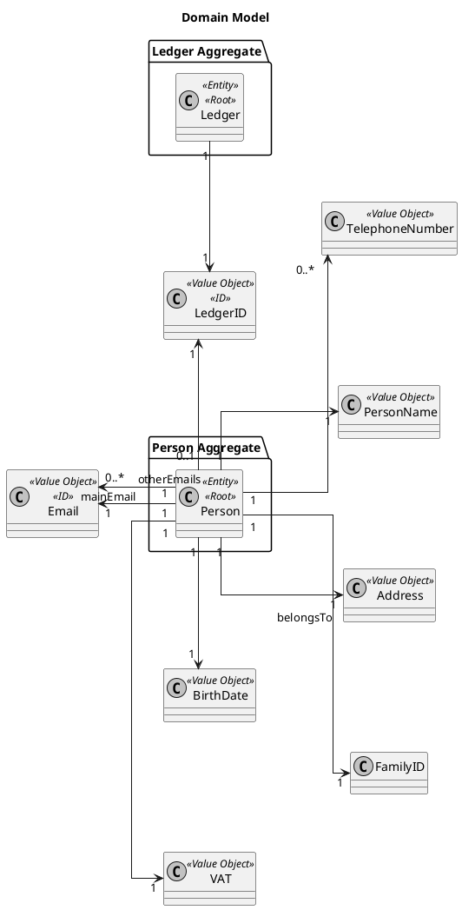
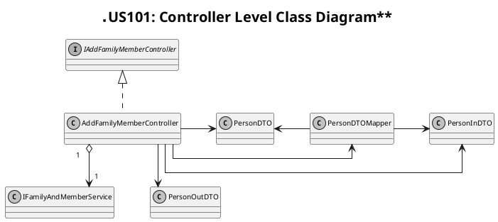
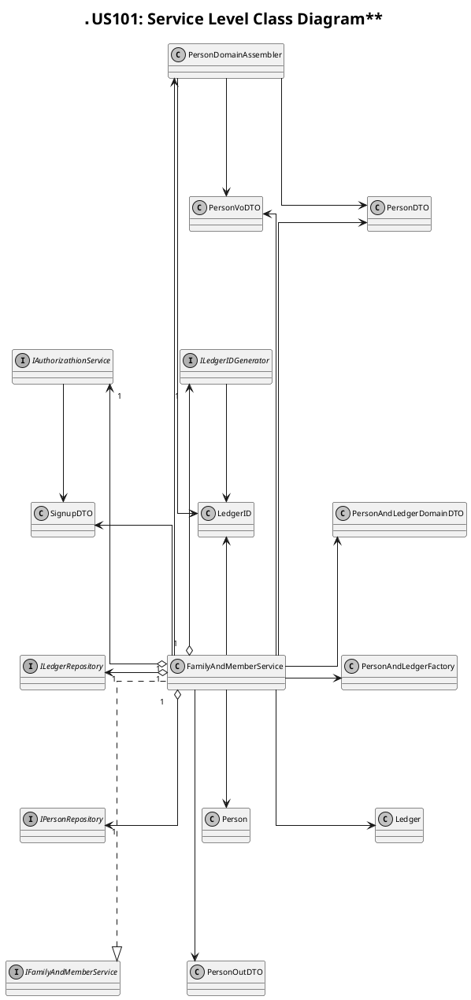
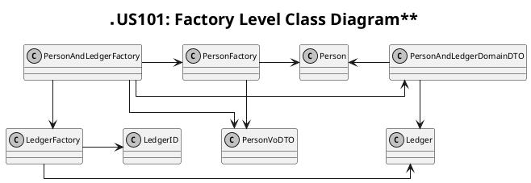
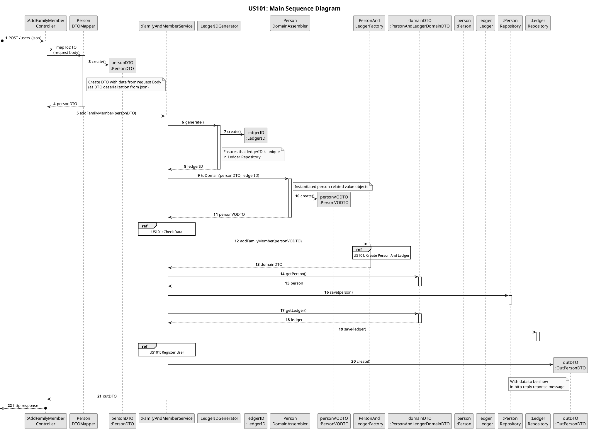
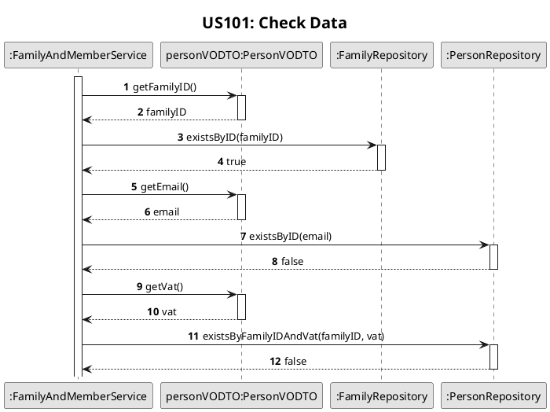
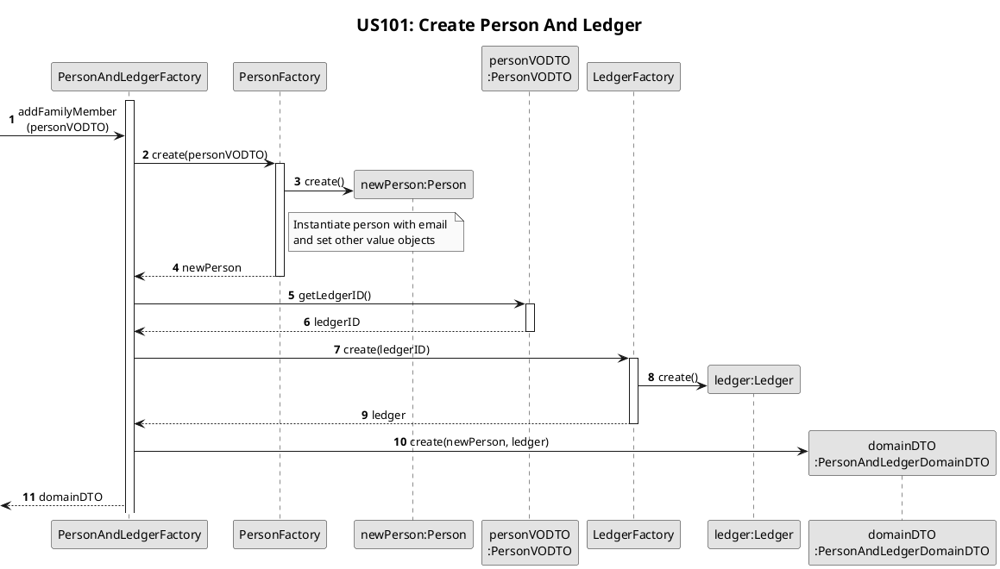
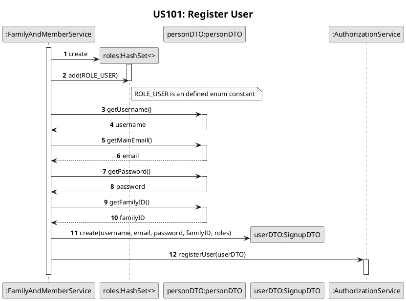

# US101
=======================================


# 1. Requirements

>__"As a family administrator, I want to add family members."__

**Demo1** As a family administrator, I want to add a new family member to my family.

- Demo1.1 - About input data, it occurs if the main email unique in the APP and VAT unique in the family. 
- Demo1.2 - About input data, it fails if the main email non-unique and/or VAT is already used in the family.
- Demo1.3 - About input data, it fails if other personal data invalid.

# 2. Analysis

We interpreted this requirement as a function for a family administrator to add a family member to its administrated family.
The inputted data follows certain rules. In a successful scenario, the new member is added to the family and the system informed the actor about success.

## 2.1 Domain Model



## 2.2 Product Owner
During the Sprint, the product owner (PO) set some specifications that contribute to the design and implementation of 
the US.

> Q: Which of the person's attributes in the system are mandatory?
- Unlike other possible system actors, to access/use the application, the person must have, at least, one email address
unique in the system.
- The vat number is also unique in family context.

> Q: Can a family member have no email or telephone?
- Most family members will have one or more emails and/or telephones. It is possible to have none (e.g. a baby or an elderly person).
- In a late response, email became mandatory.

> Q: Can a person belong to more than one family?
- No.If a person wants to be a part of another family, they must use another email address.

> Q: If personal data is wrong, what is the system's behavior?
- From a business point of view, it seems reasonable to assume that it is not possible to add an element if any of the data that characterizes it is wrong.

> Q: What is the valid format of personal data?
- The application will start to be available in Portugal, only for residents. Internationalization requirements may arise in the future.

## 2.3 Decisions

To accomplish this requirement, we need the following data:
- the ID of the family to add new member
- the personal data of new member (name, mainEmail, birthDate, vat, houseNumber, street, city, country, zipCode, List phoneNumbers, username, password)

According project goals and PO requests we decide:
- All personal data are mandatory, except telephones.
- The user can add other emails to its profile in another US.
- Validate personal data according portuguese system rules.
- The family administrator needs to give the new member username and password. In this US, this user is registered in our system.

## 2.4 Dependent US
This US depends on the creation of a family and its administrator in [US010](US010.md).
   
## 2.5 System Sequence Diagram
The System Sequence Diagram for this US are shown below:
```puml
skinparam monochrome true
autonumber
title **US101: System Sequence Diagram**
actor "Family Administrator" as User
skinparam sequenceMessageAlign center


activate User
User -> ":System" : add family member
activate ":System"
User <-- ":System" : request data (name, vat, birthDate, mainEmail, telephoneNumbers, houseNumber, street, city, country, zipCode)
deactivate ":System"
||20||
User -> ":System" : input data (name, vat, birthDate, mainEmail, telephoneNumbers, houseNumber, street, city, country, zipCode)
activate ":System"
User <-- ":System" : informs sucess
deactivate ":System"
deactivate User
```
    
# 3. Design

## 3.1. Class Diagram

The Class Diagrams for this US are shown below:







## 3.2. Sequence Diagram

The Sequence Diagrams for this US is shown below:









## 3.3. Applied Design Patterns

In this US we adopted the following GRASP principles: Controller, Information Expert, Low Coupling and High Cohesion.
Also, adopted the SOLID principles: Single Responsibility Principle.

## 3.4. Tests 

The following presented tests set up were design to evaluate the requirement of this US:

**Test 1** - Add a family member successfully:

```code 
@Test
    @DisplayName("Add family member successfully")
    void testAddMemberSuccessfully()
            throws Exception {
        //arrange
        //create family
        FamilyVoDTO familyDTO = new FamilyVoDTO(new FamilyID(UUID.randomUUID()), new LedgerID(UUID.randomUUID()), new Email("admin@gmail.com"),
                new FamilyName("Costa"));
        Family family = FamilyFactory.create(familyDTO);
        familyRepository.save(family);
        String familyID = family.getID().toString();
        //create dto with person data
        String email = "yeah@gmail.com";
        String name = "Constantino";
        List<String> phoneNumbers = new ArrayList<>();
        phoneNumbers.add("912654986");
        PersonInDTO dto = new PersonInDTO();
        dto.setEmail(email);
        dto.setName(name);
        dto.setBirthDate("2020-01-01");
        dto.setVat("123456789");
        dto.setHouseNumber("25");
        dto.setStreet("Rua Nova");
        dto.setCity("Porto");
        dto.setCountry("Portugal");
        dto.setZipCode("2156-958");
        dto.setPhoneNumbers(phoneNumbers);
        dto.setFamilyID(familyID);
        dto.setUsername("constantino");
        dto.setPassword("constantino");
        //create expected out dto
        PersonOutDTO expectedDTO = new PersonOutDTO(name, email, familyID);
        //act
        ResponseEntity<Object> response = controller.addFamilyMember(dto);
        HttpStatus resultStatus = response.getStatusCode();
        Object resultDTO = response.getBody();
        //assert
        assertEquals(HttpStatus.CREATED, resultStatus);
        assertEquals(expectedDTO, resultDTO);
    }
```

**Test 2** - Failure add a family member:
```code 
  @Test
    @DisplayName("Failure add family member: invalid person name")
    void failureAddFamilyMember_InvalidPersonName()
            throws Exception {
        //arrange
        //create family
        FamilyVoDTO familyDTO = new FamilyVoDTO(new FamilyID(UUID.randomUUID()), new LedgerID(UUID.randomUUID()), new Email("admin@gmail.com"),
                new FamilyName("Costa"));
        Family family = FamilyFactory.create(familyDTO);
        familyRepository.save(family);
        String familyID = family.getID().toString();
        //create dto with person data
        PersonInDTO dto = new PersonInDTO();
        dto.setEmail("yeah@gmail.com");
        dto.setName("123");
        dto.setBirthDate("2020-01-01");
        dto.setVat("123456789");
        dto.setHouseNumber("25");
        dto.setStreet("Rua Nova");
        dto.setCity("Porto");
        dto.setCountry("Portugal");
        dto.setZipCode("2156-958");
        dto.setFamilyID(familyID);
        dto.setUsername("constantino");
        dto.setPassword("constantino");
        //act
        ResponseEntity<Object> response = controller.addFamilyMember(dto);
        HttpStatus resultStatus = response.getStatusCode();
        //assert
        assertEquals(HttpStatus.BAD_REQUEST, resultStatus);
    }
```

There is also design another tests to coverage more possible situations of failure to add a new member, such inserts not unique data or invalid data.

# 4. Implementation

Focusing on controller-level implementation, we check rest and hateoas adoption, sending in the response links to resources with the newly created member:

```code
     @PostMapping(Constants.URI_USERS)
         public ResponseEntity<Object> addFamilyMember(@RequestBody PersonInDTO info) {
     
             PersonDTO personDTO = PersonDTOMapper.mapToDTO(info);
     
             try {
                 PersonOutDTO result = service.addFamilyMember(personDTO);
                 Link linkToViewProfile = linkTo(methodOn(ViewProfileController.class)
                         .getUserProfile(result.getMainEmail()))
                         .withRel("view profile");
                 Link linkToPersonRelations = WebMvcLinkBuilder.linkTo(methodOn(ViewFamilyRelationsFromAPersonController.class)
                         .getFamilyRelationByPersonID(result.getMainEmail()))
                         .withRel("view my family relations");
                 Link selfLink = linkTo(methodOn(AddFamilyMemberController.class)
                         .addFamilyMember(info))
                         .withSelfRel();
                 result.add(selfLink);
                 result.add(linkToViewProfile);
                 result.add(linkToPersonRelations);
                 return new ResponseEntity<>(result, HttpStatus.CREATED);
             } catch (IllegalArgumentException | InvalidDateException | InvalidVATException | InvalidEmailException | PersonAlreadyInSystemException | ElementNotFoundException | InvalidPersonNameException | BusinessErrorMessage exception) {
                 String errorMessage = "Error: " + exception.getMessage();
                 return new ResponseEntity<>(errorMessage, HttpStatus.BAD_REQUEST);
             }
         }
```

Regarding the service level, the approach is to first validate the input data by creating all corresponding value objects. Then some validations depend on repository responses occurs. There is the use of factories to create the person and their ledger simultaneously and at a level below service. It is also at the service level that the new user is registered using the corresponding service. Finally, a dto with the relevant data is sent. Using transactional annotation prevents data from being written in the database if some part of the process fails:

```code
     @Transactional(rollbackFor = Exception.class)
         public PersonOutDTO addFamilyMember(PersonDTO personDTO)
                 throws InvalidDateException, InvalidVATException, InvalidEmailException, PersonAlreadyInSystemException,
                 InvalidPersonNameException, ElementNotFoundException, BusinessErrorMessage {
     
             //create family member
             LedgerID ledgerID = ledgerIDGenerator.generate();
             PersonVoDTO personVoDTO = PersonDomainAssembler.toDomain(personDTO, ledgerID);
     
             if (!familyRepository.existsByID(personVoDTO.getFamilyID())) {
                 throw new ElementNotFoundException(Constants.FAMILY_NOT_FOUND);
             }
             if (personRepository.existsByID(personVoDTO.getEmail())) {
                 throw new PersonAlreadyInSystemException("Email Already Used");
             }
             if (personRepository.existsByFamilyIDAndVat(personVoDTO.getFamilyID(), personVoDTO.getVat())) {
                 throw new InvalidVATException("Vat Already Used In This Family");
             }
     
             PersonAndLedgerDomainDTO personAndLedgerDomainDTO = PersonAndLedgerFactory.create(personVoDTO);
             Person person = personAndLedgerDomainDTO.getPerson();
             personRepository.save(personAndLedgerDomainDTO.getPerson());
             ledgerRepository.save(personAndLedgerDomainDTO.getLedger());
     
             //create user
             Set<String> roles = new HashSet<>();
             roles.add(ERole.ROLE_USER.name());
             SignupDTO registerUserDTO = new SignupDTO(personDTO.getUsername(), personDTO.getEmail(), personDTO.getPassword(), personDTO.getFamilyID(), roles);
             signUpService.registerUser(registerUserDTO);
     
     
             return new PersonOutDTO(person.getName().toString(), person.getMainEmail().toString(), person.getFamilyID().toString());
         }
```

There are another methods that are used in this US. In a overall view, all methods ensures that something failed during process, the process aborts and member not created, neither add to family.       

# 5. Integration/Demo
 
About [US010](US010.md), there be an effort to presents a similar approach to this US, and both US share the same way to create a new Person, with some differences in data validation.
This US was successfully integrated with the remaining US.

# 6. Observations

This US has been modified in practically every sprint and we believe this version is more stable and optimized than the previous ones.
