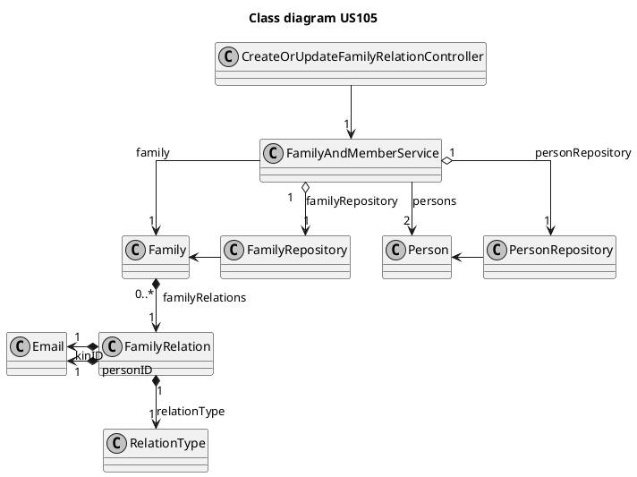
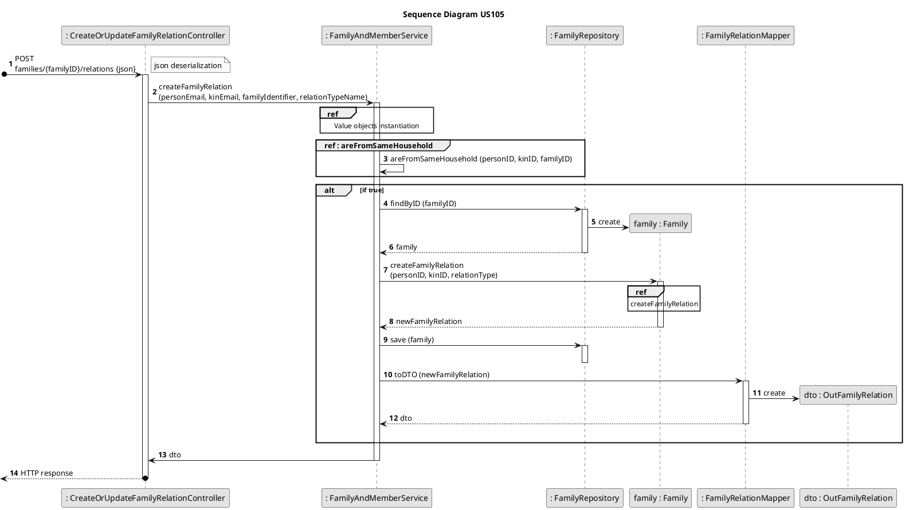
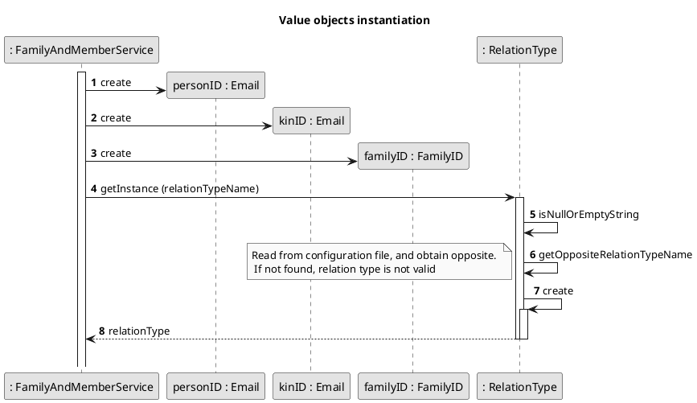
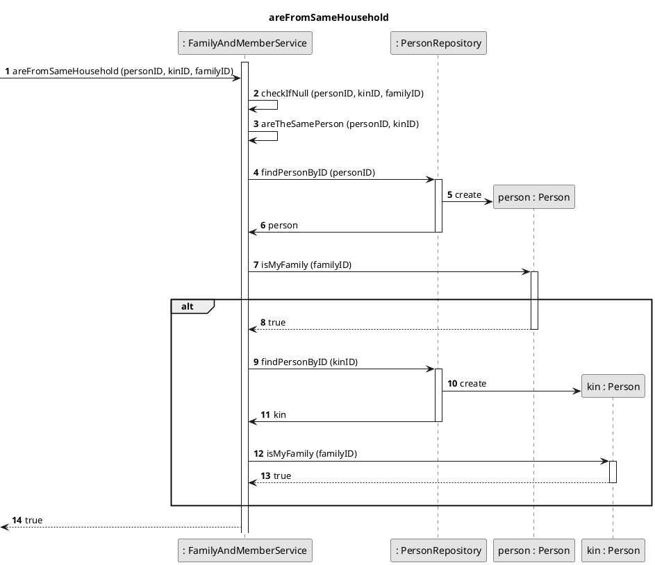
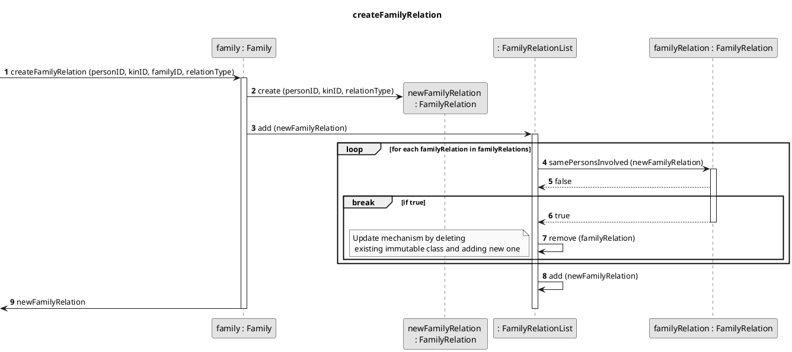

# US105
=======================================

## 1. Requirements

>__"As a family administrator, I want to create a relation between two family members."__

## 1.1 Description

The family administrator has the possibility to select two members of his family and define a relation between them.
The selected members cannot be the same person and don't need to include the administrator. That give us a more flexible functionality by maintaining the possibility of a broader range of connections if necessary.

**Demo1** As family administrator, I want to select two members that I want to relate

- Demo1.1. if a family as less than two members, I cannot go further with this function.
- Demo1.2. a list of family members is displayed to me, and I select two members.
- Demo2.1. I choose the type of relation that connects the two family members.

We interpreted this requirement as a direct possibility of the family administrator to connect any member of the family to another member through a family relation.

## 2. Analysis

## 2.1 Domain Model according to Evans

```puml
@startuml

skinparam linetype ortho
hide empty members
hide circles
skinparam monochrome true
title Domain Model

package "Person Aggregate"{
  class Person <<Entity>> <<Root>> {}
}

package "Family Aggregate"{
  class Family <<Entity>> <<Root>> {}
}

class Email <<Value Object>> <<ID>> {}
class FamilyID <<Value Object>> <<ID>> {}

class FamilyRelation <<Value Object>> {}
class RelationType <<Value Object>> {}


'----------Associations----------

Person "1" -r> "1" Email : "id          "

Family "1" --> "1" FamilyID : id

Person "1" -l-> "1" FamilyID : inFamily

Family "1" -r-> "0..*" FamilyRelation

FamilyRelation "1" --> "1" RelationType
FamilyRelation "0..1" --> "1" Email : personID
FamilyRelation "0..1" --> "1" Email : kinID

@enduml
```

## 2.2 Product Owner 

Some answers from the product owner (PO) are important in some design decisions.

> The definition of a relation isn't done at the creation of a member of the family. 
>
- That means that at anytime the family administrator has the power to define it.

> Q: As a family administrator, I want to get a list of family members, and the relation that they have with me. 
> 
> A: It's possible, but it would mean to translate existing relations to relations with the family administrator.
>
> Q: As family administrator, I want to get a list of family members and all possible relations between them. 
> 
> A: There are a lot of possible combinations. That functionality seems useless.

- The greatest question here hangs on the possibility of just being necessary to relate a member and his family administrator.
If we interpret the last answer as to display all relations as something useless. It would mean that the US105 wants to let the administrator create a relation between any two members. This interpretation is supported by the second answer.

## 2.3 Decisions

- The family relations are stored in a list inside the Family class. The family knows the relations of its members.

- The FamilyRelation instance has three instance variables: a person ID, a kin ID and a relation type that connects the two members. 
  
- To avoid the creation of a symmetric family relation, i.e. person is parent of kin and kin is child of person, the RelationType value object will have a method to return its opposite value. The class is immutable.
That forces us to a special override of the equals() method: two instances of FamilyRelation are the same if personID == other.personID && kinID == other.kinID || personID == other.kinID && kinID == other.personID. One interesting drawback was identified during the implementation of a persistence layer.
  The translation between Object-oriented programming and a relational database is not perfect if the above mentioned definition of the equals method is adopted. To overturn this problem a special validation must be made before "saving" the instance in the database.
  
- When creating and adding a new FamilyRelation, we need first see if this family relation was already defined, using the above mentioned equals() method.
If true, we delete this FamilyRelation instance and create a new one. If it returns false, we just create a new instance.
The function can act has creator or updater.
  
## 2.4 Dependent US

- The [US104](US104.md) is greatly dependent on the present US.
- The way [US104](US104.md) accesses the information is closely related to the way this US is implemented.
- The [US106](../sp2/US106.md) user story talks about updating an existent family relation. This functionality is already covered by this US.

## 2.5 System Sequence Diagram
```puml
skinparam monochrome true
autonumber
title SSD
actor "Family Administrator"

"Family Administrator" -> "FFM Application" : create relation between two family members
activate "Family Administrator"
activate "FFM Application"
|||  
"Family Administrator" <-- "FFM Application" : Present list of family members
|||
"Family Administrator" <-- "FFM Application" : Ask for type of relation
|||
"Family Administrator" -> "Family Administrator" : Select two family members
|||

"Family Administrator" -> "Family Administrator" : Select a relation type
|||
"Family Administrator" -> "FFM Application" : send input
|||
"Family Administrator" <-- "FFM Application" : response
deactivate "Family Administrator"
deactivate "FFM Application"

```

# 3. Design

## 3.1 Class Diagram



## 3.2 Sequence Diagram


[//]: <> (=================================================================================)



[//]: <> (=================================================================================)



[//]: <> (=================================================================================)



## 3.3. Applied Design Patterns

From GRASP pattern:
Controller,
Information Expert,
Low Coupling

From SOLID:
Single Responsibility Principle,
Indirection

Protected Variation
Factory


## 3.4. Tests 

**Test 1:** Integration Test: create a family relation successfully:

    @Test
    @DisplayName("Create a family relation - success")
    void createFamilyRelationSuccess() throws Exception {
        //arrange

        //create family
        String adminEmail = "margaret_hamilton@gmail.com";
        Email adminID = new Email(adminEmail);
        String username = "Maggy";
        String password = "1234";

        List<String> phoneNumbers = new ArrayList<>();
        phoneNumbers.add("912343546");
        FamilyAndAdminDTO dto = new FamilyAndAdminDTO("Margaret Hamilton", "1904-12-01", "213025086", "14", "Logical Street",
                "Porto", "Portugal", "2100-345", phoneNumbers, adminEmail, "Hamilton", username, password);

        service.startFamily(dto);

        Person admin = personRepository.findByID(adminID);
        FamilyID familyID = admin.getFamilyID();

        //add new member
        TelephoneNumberList telephoneNumberList = new TelephoneNumberList();
        telephoneNumberList.add(new TelephoneNumber("225658542"));
        Address address = new Address("Rua Velha", "2", "4125-100", "Porto", "Portugal");

        String kinEmail = "john_von_neumann@hotmail.com";

        PersonVoDTO voPersonDTO = new PersonVoDTO(
                new PersonName("Johnny"),
                new BirthDate("1907-06-08"),
                new VAT("286710455"),
                address,
                telephoneNumberList,
                new Email(kinEmail),
                familyID,
                new LedgerID(UUID.randomUUID()));
        Person person = PersonFactory.create(voPersonDTO);
        personRepository.save(person);

        int expectedCode = 201;
        int expectedListSize = 1;
        int resultListSize;

        FamilyRelationInDTO info = new FamilyRelationInDTO(adminEmail, kinEmail, Constants.CHILD);

        //act
        ResponseEntity<Object> result = controller.createOrUpdateFamilyRelation(familyID.toString(), info);

        Family family = familyRepository.findByID(familyID);
        List<FamilyRelation> familyRelationList = family.getFamilyRelationByPersonID(adminID);
        resultListSize = familyRelationList.size();

        //assert
        assertEquals(expectedCode, result.getStatusCodeValue());
        assertEquals(expectedListSize, resultListSize);
    }

**Test 2:** Integration Test: create a family relation - invalid relation type:

    @Test
    @DisplayName("Create a family relation - illegal relation type")
    void createFamilyRelationIllegalRelation() throws Exception {
        //arrange

        //create family
        String adminEmail = "margaret_hamilton@gmail.com";
        Email adminID = new Email(adminEmail);
        String username = "Maggy";
        String password = "1234";

        List<String> phoneNumbers = new ArrayList<>();
        phoneNumbers.add("912343546");
        FamilyAndAdminDTO dto = new FamilyAndAdminDTO("Margaret Hamilton", "1904-12-01", "213025086", "14", "Logical Street",
                "Porto", "Portugal", "2100-345", phoneNumbers, adminEmail, "Hamilton", username, password);

        service.startFamily(dto);

        Person admin = personRepository.findByID(adminID);
        FamilyID familyID = admin.getFamilyID();

        //add new member
        TelephoneNumberList telephoneNumberList = new TelephoneNumberList();
        telephoneNumberList.add(new TelephoneNumber("225658542"));
        Address address = new Address("Rua Velha", "2", "4125-100", "Porto", "Portugal");

        String kinEmail = "john_von_neumann@hotmail.com";

        PersonVoDTO voPersonDTO = new PersonVoDTO(
                new PersonName("Johnny"),
                new BirthDate("1907-06-08"),
                new VAT("286710455"),
                address,
                telephoneNumberList,
                new Email(kinEmail),
                familyID,
                new LedgerID(UUID.randomUUID()));
        Person person = PersonFactory.create(voPersonDTO);
        personRepository.save(person);

        int expectedCode = 400;
        int expectedSize = 0;
        int resultSize;

        FamilyRelationInDTO info = new FamilyRelationInDTO(adminEmail, kinEmail, "Mistress");

        //act
        ResponseEntity<Object> result = controller.createOrUpdateFamilyRelation(familyID.toString(), info);

        Family family = familyRepository.findByID(familyID);

        List<FamilyRelation> familyRelationList = family.getFamilyRelationByPersonID(adminID);
        resultSize = familyRelationList.size();

        //assert
        assertEquals(expectedCode, result.getStatusCodeValue());
        assertEquals(resultSize, expectedSize);
    }

**Test 3:** Integration Test: create a family relation - members of different families:

    @Test
    @DisplayName("Create a family relation - different families")
    void createFamilyRelationDifferentFamilies() throws Exception {
        //arrange

        //create family
        String adminEmail = "margaret_hamilton@gmail.com";
        Email adminID = new Email(adminEmail);
        String username = "Maggy";
        String password = "1234";

        List<String> phoneNumbers = new ArrayList<>();
        phoneNumbers.add("912343546");
        FamilyAndAdminDTO dto = new FamilyAndAdminDTO("Margaret Hamilton", "1904-12-01", "213025086", "14", "Logical Street",
                "Porto", "Portugal", "2100-345", phoneNumbers, adminEmail, "Hamilton", username, password);

        service.startFamily(dto);

        Person admin = personRepository.findByID(adminID);
        FamilyID familyID = admin.getFamilyID();

        //add new member
        TelephoneNumberList telephoneNumberList = new TelephoneNumberList();
        telephoneNumberList.add(new TelephoneNumber("225658542"));
        Address address = new Address("Rua Velha", "2", "4125-100", "Porto", "Portugal");

        String kinEmail = "john_von_neumann@hotmail.com";

        PersonVoDTO voPersonDTO = new PersonVoDTO(
                new PersonName("Johnny"),
                new BirthDate("1907-06-08"),
                new VAT("286710455"),
                address,
                telephoneNumberList,
                new Email(kinEmail),
                familyID,
                new LedgerID(UUID.randomUUID()));
        Person person = PersonFactory.create(voPersonDTO);
        personRepository.save(person);

        FamilyID otherFamilyID = new FamilyID(UUID.randomUUID());

        int expectedCode = 400;
        int expectedSize = 0;
        int resultSize;

        FamilyRelationInDTO info = new FamilyRelationInDTO(adminEmail, kinEmail, Constants.CHILD);

        //act
        ResponseEntity<Object> result = controller.createOrUpdateFamilyRelation(otherFamilyID.toString(), info);

        Family family = familyRepository.findByID(familyID);

        List<FamilyRelation> familyRelationList = family.getFamilyRelationByPersonID(adminID);
        resultSize = familyRelationList.size();

        //assert
        assertEquals(expectedCode, result.getStatusCodeValue());
        assertEquals(resultSize, expectedSize);
    }

# 4. Implementation


# 5. Integration/Demo


# 6. Observations

The mapping from OO to relational database could be handled differently. 
The solution adopted to answer the symmetry between family relations could be different by accepting that the redundant information is not important since the PO didn't define here any special requirements.

