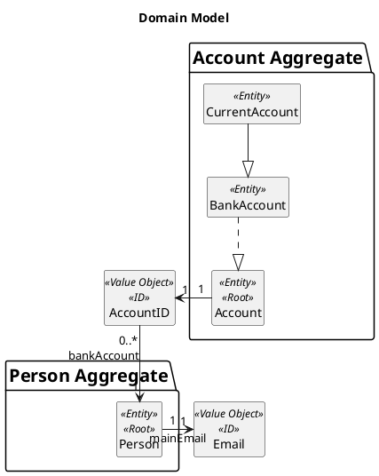
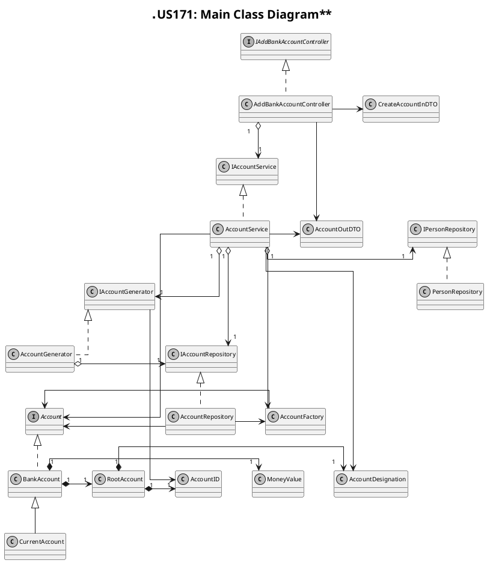
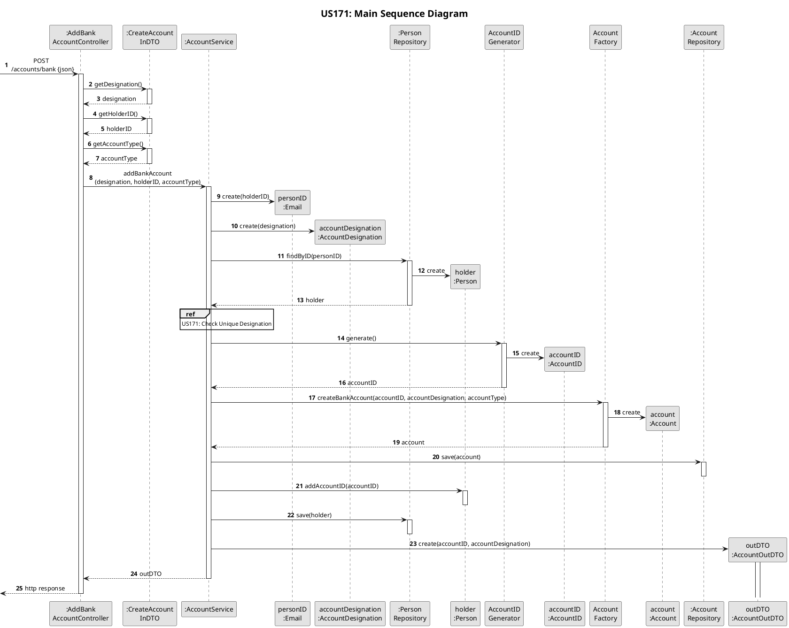
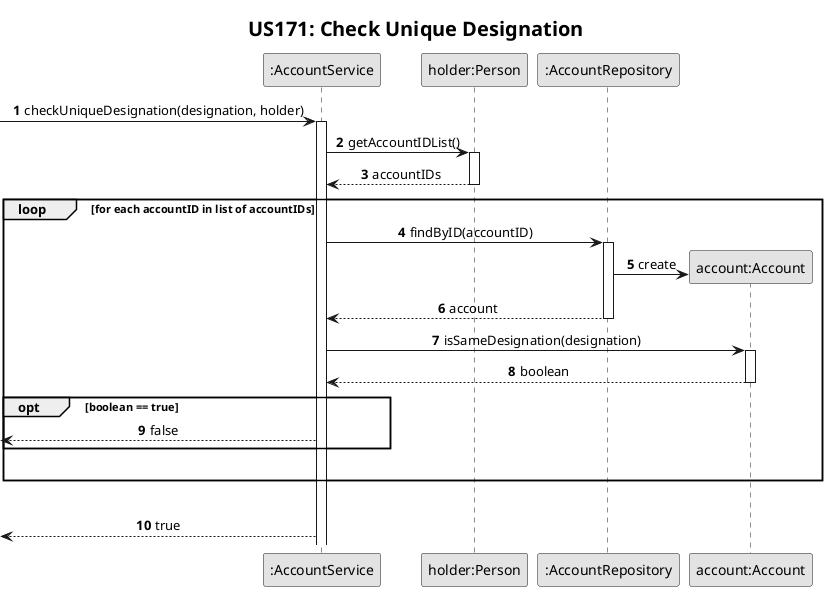

# US171
=======================================


# 1. Requirements

>__"As a family member, I want to add a bank account I have."__

All family members have the possibility to add a current bank account to their personal accounts.

**Demo1** As a family member, I want to add a current account I have.
- Demo1.1 - I  define the necessary data to add a current account.
- Demo1.2 - I receive information about operation success.

# 2. Analysis

## 2.1 Domain Model



## 2.2 Product Owner 
During the Sprint, the product owner (PO) set some specifications that contributed to the design and implementation of 
the US.
> Accounts must have a categoryDesignation that allows it to be identified.

> The most reasonable solution would be for the initial amount to be set when loading a bank statement.

## 2.3 Decisions
To accomplish this requirement, we need the following data:
- the holder's ID
- the account designation

According project goals and PO requests we decide:
- The Bank Account mentioned in this US is designate Current Account within this project.
- The account designation is mandatory and cannot be left blank or empty.
- Each personal account (current, savings, credit card and cash accounts) of each member has a unique designation among their accounts.
- If any problem occurs during the process it is interrupted and the actor is informed.

## 2.4 Dependent US
This US is very similar to [US172](US172.md) and [US173](US173.md) which also add bank accounts, so they are all integrated into the same controller that receives the account type as a parameter.

## 2.5 System Sequence Diagram
The System Sequence Diagram for this US are shown below:
```puml
skinparam monochrome true
autonumber
title **US171: System Sequence Diagram**
actor "Family Member" as User
skinparam sequenceMessageAlign center

User -> ":System" : create current account
activate User
activate ":System"
User <-- ":System" : request data (designation)
deactivate ":System"
User -> ":System" : input required data (designation)
activate ":System"
User <-- ":System" : informs sucess
deactivate ":System"
deactivate User
```
# 3. Design

## 3.1. Class Diagram

The Class Diagram for this US are shown below:


## 3.2. Sequence Diagram
The Sequence Diagram for this US is shown below:




## 3.3. Applied Design Patterns
In this US we adopted the following GRASP principles: Controller, Information Expert, Low Coupling and High Cohesion
Also, adopted the SOLID principles: Single Responsibility Principle.

## 3.4. Tests 
The following presented tests set up were design to evaluate the requirement of this US:

**Test 1:** Add a current account successfully:

```code 
@Test
    @DisplayName("Add current account successfully")
    void testAddCurrentAccountSuccessfully() throws Exception {
        //arrange
        String designation = "Account";
        String holderID = "admin@gmail.com";
        String accountType = "current";

        FamilyVoDTO familyDTO = new FamilyVoDTO(new FamilyID(UUID.randomUUID()),new LedgerID(UUID.randomUUID()),new Email(holderID),new FamilyName("Churchill"));
        Family family = FamilyFactory.create(familyDTO);
        familyRepository.save(family);
        FamilyID familyID = family.getID();

        List<String> telephones = new ArrayList<>();
        telephones.add("922658453");
        PersonVoDTO voPersonDTO = new PersonVoDTO(
                new PersonName("Joaquina"),
                new BirthDate("2020-03-02"),
                new VAT("123456789"),
                new Address("Rua Escura", "25", "2156-956", "Porto", "Portugal"),
                new TelephoneNumberList(telephones),
                new Email(holderID),
                familyID,
                new LedgerID(UUID.randomUUID()));
        Person member = PersonFactory.create(voPersonDTO);
        personRepository.save(member);

        String data = "{\n" +
                "    \"designation\": \"" + designation + "\",\n" +
                "    \"holderID\": \"" + holderID + "\",\n" +
                "    \"accountType\": \"" + accountType + "\"" +
                "}";

        //act-assert
        this.mockMvc.perform(post("/accounts/bank")
                .contentType(mediaType)
                .content(data))
                .andDo(print())
                .andExpect(status().isCreated());
    }
```

**Test 2:** Failure add a current account:

```code 
    @Test
    @DisplayName("Failure add current account: holder not exists")
    void testFailureAddCurrentAccount_HolderNotExists() throws Exception {
        //arrange
        String designation = "Account";
        String holderID = "admin@gmail.com";
        String accountType = "current";

        FamilyVoDTO familyDTO = new FamilyVoDTO(new FamilyID(UUID.randomUUID()),new LedgerID(UUID.randomUUID()),new Email(holderID),new FamilyName("Churchill"));
        Family family = FamilyFactory.create(familyDTO);
        familyRepository.save(family);

        String data = "{\n" +
                "    \"designation\": \"" + designation + "\",\n" +
                "    \"holderID\": \"" + holderID + "\",\n" +
                "    \"accountType\": \"" + accountType + "\"" +
                "}";

        //act-assert
        this.mockMvc.perform(post("/accounts/bank")
                .contentType(mediaType)
                .content(data))
                .andDo(print())
                .andExpect(status().isBadRequest());
    }
```

There is also design another tests to coverage more possible situations of failure to add a new member, such inserts not unique data or invalid data.

# 4. Implementation

Observing the implementation of US at the controller level, the use of REST and HATEOAS stands out. As mentioned earlier, in this controller, current, credit, and savings accounts can be added.

```code 
@PostMapping(value = "/accounts/bank")
    public ResponseEntity<Object> addBankAccount(@RequestBody CreateAccountInDTO info) {
        try {
            AccountOutDTO result = accountService.addBankAccount(info.getDesignation(), info.getHolderID(), info.getAccountType());
            Link linkToViewBalance = WebMvcLinkBuilder.linkTo(methodOn(CheckAccountBalanceController.class)
                    .checkAccountBalance(info.getHolderID(), result.getAccountID()))
                    .withRel("view account balance");
            result.add(linkToViewBalance);
            return new ResponseEntity<>(result, HttpStatus.CREATED);
        } catch (InvalidEmailException | ClassNotFoundException | ElementNotFoundException | InstantiationException | IllegalArgumentException | NullPointerException | AccountNotCreatedException | InvalidDateException | InvalidVATException | InvalidPersonNameException | NoSuchMethodException | InvocationTargetException | IllegalAccessException | IOException exception) {
            String errorMessage = "Error: " + exception.getMessage();
            return new ResponseEntity<>(errorMessage, HttpStatus.BAD_REQUEST);
        }

    }
```    

Regarding to service level implementation, value objects are created and the account designation is checked to be unique for that member.
The account is created through its factory, which through the account type will find the constructor of that class and instantiate it. Transactional annotation allows the rollback of data stored in the database in case there is any problem in the process.

```code 
 @Transactional(rollbackFor = Exception.class)
    public AccountOutDTO addBankAccount(String designation, String personIDString, String accountType)
            throws ElementNotFoundException, InvalidEmailException, AccountNotCreatedException, InvalidDateException, InvalidVATException,
            InvalidPersonNameException {
        Email parseHolderID = new Email(personIDString);
        AccountDesignation parseDesignation = new AccountDesignation(designation);
        Person person = this.personRepository.findByID(parseHolderID);
        if (!checkUniqueDesignation(parseDesignation, person)) {
            throw new AccountNotCreatedException("The account designation is already used");
        }
        AccountID bankAccountID = accountIDGenerator.generate();
        Account account = AccountFactory.createBankAccount(bankAccountID, parseDesignation, accountType);
        this.accountRepository.save(account);
        person.addAccountID(bankAccountID);
        this.personRepository.save(person);
        return new AccountOutDTO(bankAccountID.toString(), designation);
    }
```

Regarding account structuring, our approach was to design an Account interface. The BankAccount class implements this interface and, by composition, contains a RootAccount class that avoids code duplication. Finally, CurrentAccount just extends this BankAccount class.

There are another methods that are used in this US.

# 5. Integration/Demo
This US was successfully integrated with the remaining ones.
This US is integrated with the use of Spring Boot, JPA, Rest, and Hateoas. And respect DDD and Onion Architecture.

# 6. Observations
This US has been modified with the architectural changes and we believe this version is more stable and optimized than the previous ones.