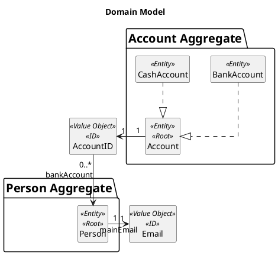
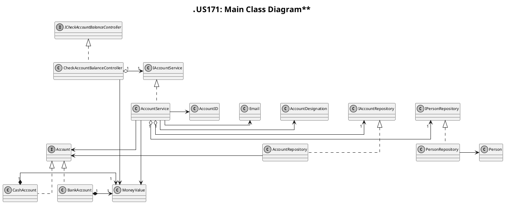
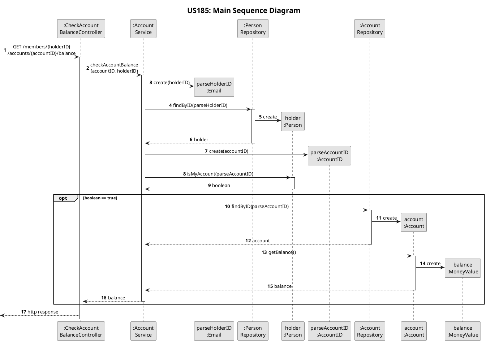

# US185
=======================================


# 1. Requirements

>__"As a family member, I want to check the balance of one of my accounts."__

All family members have the possibility to check the balance of one of their personal accounts.

**Demo1** As a family member, I want to check the balance of one of my accounts.
- Demo1.1 - I select the account that I want to check the balance.
- Demo1.2 - I receive balance of chosen account.

# 2. Analysis

## 2.1 Domain Model



## 2.2 Product Owner 
During the Sprint, the product owner (PO) set some specifications that contribute to the design and implementation of 
the US.
> The balance calculation can vary for each type of account.

## 2.3 Decisions
To accomplish this requirement, we need the following data:
- the holder's ID and account's ID

According project goals and PO requests we decide:
- Only a holder can check account balance.
- If any problem occurs during the process it is interrupted and the actor is informed.

## 2.4 Dependent US
This US is similar to [US135](US135.md), since both obtain an account balance, the difference is that in US135 the family administrator can check the balance of both family and personal accounts, and in this US the family member can only check the balance of one of his account.

## 2.5 System Sequence Diagram
The System Sequence Diagram for this US are shown below:
```puml
skinparam monochrome true
autonumber
title **US185: System Sequence Diagram**
actor "Family Member" as User
skinparam sequenceMessageAlign center


User -> ":System" : check account balance
activate User
activate ":System"
User <-- ":System" : request to select account
deactivate ":System"
||15||
User -> ":System" : input selected account
activate ":System"
User <-- ":System" : informs balance
deactivate ":System"
deactivate User
```

# 3. Design

## 3.1. Class Diagram
The Class Diagram for this US are shown below:


## 3.2. Sequence Diagram
The Sequence Diagram for this US is shown below:


## 3.3. Applied Design Patterns
In this US we adopted the following GRASP principles: Controller, Information Expert, Low Coupling.
Also, adopted the SOLID principles: Single Responsibility Principle.

## 3.4. Tests 
The following presented tests set up were design to evaluate the requirement of this US:
    
**Test 1:** Check account balance successfully

```code 
 @Test
    @DisplayName("Check person cash account balance successfully")
    void testCheckAccountBalanceSuccessfully_PersonCashAccount()
            throws Exception {
        //arrange
        String holderID = "admin@gmail.com";
        String balance = "20.36";

        MoneyValue initialBalance = new MoneyValue(BigDecimal.valueOf(20.36));
        CashAccount cashAccount = (CashAccount) AccountFactory.createCashAccount(new AccountID(UUID.randomUUID()), new AccountDesignation("Account"),initialBalance);
        accountRepository.save(cashAccount);
        String accountID = cashAccount.getID().toString();

        List<String> telephones = new ArrayList<>();
        telephones.add("922658453");
        PersonVoDTO voPersonDTO = new PersonVoDTO(
                new PersonName("Joaquina"),
                new BirthDate("2020-03-02"),
                new VAT("123456789"),
                new Address("Rua Escura", "25", "2156-956", "Porto", "Portugal"),
                new TelephoneNumberList(telephones),
                new Email(holderID),
                new FamilyID(UUID.randomUUID()),
                new LedgerID(UUID.randomUUID()));

        Person member = PersonFactory.create(voPersonDTO);
        member.addAccountID(cashAccount.getID());
        personRepository.save(member);

        //act-assert
        this.mockMvc.perform(get("/members/" + holderID + "/accounts/" + accountID + "/balance"))
                .andDo(print())
                .andExpect(status().isOk())
                .andExpect(content().string(containsString(balance)));
    }
```
    
**Test 2:** Failure check account balance

```code  
 @Test
    @DisplayName("Failure check account balance: account not found")
    void failureCheckAccountBalance_AccountNotFound() throws Exception {
        //arrange
        String holderID = "admin@gmail.com";

        Account currentAccount = AccountFactory.createBankAccount(new AccountID(UUID.randomUUID()), new AccountDesignation("Account"), Constants.CURRENT_ACCOUNT_TYPE);
        String accountID = currentAccount.getID().toString();

        List<String> telephones = new ArrayList<>();
        telephones.add("922658453");
        PersonVoDTO voPersonDTO = new PersonVoDTO(
                new PersonName("Joaquina"),
                new BirthDate("2020-03-02"),
                new VAT("123456789"),
                new Address("Rua Escura", "25", "2156-956", "Porto", "Portugal"),
                new TelephoneNumberList(telephones),
                new Email(holderID),
                new FamilyID(UUID.randomUUID()),
                new LedgerID(UUID.randomUUID()));
        Person member = PersonFactory.create(voPersonDTO);
        member.addAccountID(currentAccount.getID());
        personRepository.save(member);

        //act-assert
        this.mockMvc.perform(get("/members/" + holderID + "/accounts/" + accountID + "/balance"))
                .andDo(print())
                .andExpect(status().isBadRequest())
                .andExpect(content().string(containsString("Account not found")));
    }
```

There is also design another tests to coverage more possible situations of failure.       
       
# 4. Implementation

At the controller level, the implementation denotes the use of REST.

```code 
 @GetMapping("members/{holderID}/accounts/{accountID}/balance")
    public ResponseEntity<Object> checkAccountBalance(@PathVariable String holderID, @PathVariable String accountID) {
        try {
            MoneyValue balance = service.checkAccountBalance(accountID, holderID);
            return new ResponseEntity<>(balance.toString(), HttpStatus.OK);
        } catch (InvalidEmailException | ElementNotFoundException | InvalidAccountOwner | AccountNotCreatedException | InvalidDateException | InvalidVATException | InvalidPersonNameException | InstantiationException | ClassNotFoundException | NoSuchMethodException | InvocationTargetException | IllegalAccessException | IOException exception) {
            String errorMessage = "Error: " + exception.getMessage();
            return new ResponseEntity<>(errorMessage, HttpStatus.BAD_REQUEST);
        }
    }
```

At the service level, the value objects are instantiated and check that the account belongs to the holder. After this, the account balance is returned.

```code 
public MoneyValue checkAccountBalance(String accountID, String holderID)
            throws InvalidEmailException, ElementNotFoundException, InvalidAccountOwner, InvalidDateException, InvalidVATException, InvalidPersonNameException, AccountNotCreatedException {
        Email parseHolderID = new Email(holderID);
        Person holder = this.personRepository.findByID(parseHolderID);
        AccountID parseAccountID = new AccountID(UUID.fromString(accountID));
        if (!holder.isMyAccount(parseAccountID)) {
            throw new InvalidAccountOwner("Account does not belong to this holder");
        }
        Account account = this.accountRepository.findByID(parseAccountID);
        return account.getBalance();
    }
```

# 5. Integration/Demo
This US is integrate with the different accounts, since the balance can be updated differently in each account, being this US responsible for only transmitting the balance value when requested.
This US was successfully integrated with the remaining ones. This US is integrated with the use of Spring Boot, JPA, Rest, and Hateoas. And respect DDD and Onion Architecture.

# 6. Observations
This US has been modified with the architectural changes and we believe this version is more stable and optimized than the previous ones.
However, at the bank accounts level, the balance response will always be a fixed amount of zero. This occurs because at this point there are no requirements to make bank account movements.