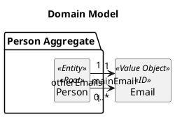
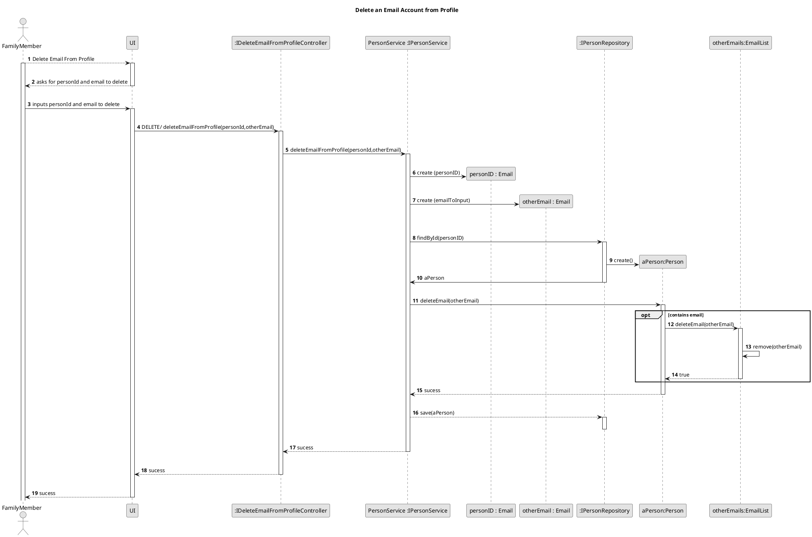
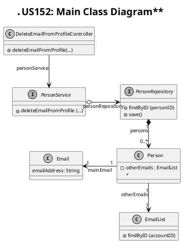

US152 - Delete email from profile 
===============================================================


# 1. Requirements

>__"As a family member, I want to delete an email account to my profile."__

## 1.1. Description 
* Any family member has the possibility to add delete email their profile. 

# 2. Analysis
To meet this requirement, a few key pieces of data are need: 
- An ID to identify the user ( in this case will be an Email)
- Another email to be deleted to his profile


##2.1. Domain Model 





## 2.2. Product Owner Requirements
During the Sprint, the product owner (PO) set some specifications that contribute to the design and implementation of 
the US.

> Q: Can a person (or administrator) belong to more than one family?
- No.If a person wants to be a part of another family, they must use another email address.

- Also, a person, i.e. the member of a family, has a name, unique ID (email) and VAT number (...).
Most persons will also have one or more telephone numbers and other email accounts. 

> Q: is it correct to allow Person B to add Person A's uniqueID as a secondary email?
- Don't see a problem.


## 2.3 Decisions
- One of decisions in the beginning of the project, was about the class where the add email operation should be stored, it was decided to implement on the Person because it is an action made by a Person.
- Another decision that was made was to assume that the email to be introduced must be an email that is not assigned already to the user.
- In the event of a case a family member try to add an email list with one email address on invalid format, none of the emails of the present list are added to the email list that the person has.
- Taking into account the possibility that a person may belong to two families, he cannot have the same email to be added to both.
- The ID is unique but the other emails can be repeated.

## 2.4. US Dependencies

* This User Story has other user stories dependencies, like US150(get my profile’s information), US010 (to create a family) and US101 (add family members),
 because that is necessary to have a family in order to add family members and to create a profile information, and then an only then it is possible to add an email account to the actor's profile.
 
## 2.5. System Sequence Diagram

```puml
skinparam monochrome true
autonumber
title SSD
actor "Family Member"

"Family Member" -> "System" : delete an email account from my profile 
activate "Family Member"
activate "System"
|||  
"Family Member" <-- "System" : asks my personID and email to delete

"Family Member" -> "System" : inputs my personID and email

|||
"Family Member" <-- "System" : returns result
deactivate "Family Member"
deactivate "System"

```
 
 
# 3. Design

## 3.1. Functionalities Flow



## 3.2. Class Diagram


The main Classes involved are:
 - DeleteEmailFromProfileController
 - PersonService
 - Person    
 - EmailList
 - PersonRepository
 



## 3.3. Applied Design Patterns

From GRASP design pattern was applied the principles of Controller, Information Expert and Low Coupling.
From SOLID pattern was applied the Single Responsability Principle.

# 4. Implementation

        @Transactional(rollbackFor = Exception.class)
        public boolean deleteEmailFromProfile(String personId, String otherEmail) throws InvalidEmailException, InvalidDateException, ElementNotFoundException, InvalidVATException, InvalidPersonNameException {
            Email personID = new Email(personId);
            Email emailToDelete = new Email(otherEmail);
            Person person = personRepository.findByID(personID);
            person.removeEmail(emailToDelete);
            personRepository.save(person);
            return true;


After the controller, all value objects are instantiated (personId and emailToDelete) and then we verify if the person exists on the application. In a positive case,  we go to the person Class to assure that the email that we want to remove exists. If it does we can remove it and return a response to our controller.


          public boolean removeEmail(Email email)
            {
                if(!containsEmail(email))
                {
                    throw new IllegalArgumentException("Email not found");
                }
                otherEmails.remove(email);
                return true;
            }

# 5. Tests

Delete email from my profile

        @Test
        @DisplayName("Delete an email from my profile")
        void deleteEmailFromProfile() throws Exception {
            //arrange
            FamilyID family1ID = new FamilyID(UUID.randomUUID());
            TelephoneNumberList telephoneNumberList1 = new TelephoneNumberList();
            telephoneNumberList1.add(new TelephoneNumber("225658541"));
            Email personID = new Email("alan_turing@hotmail.com");
            Address address1 = new Address("Rua Nova", "25", "4125-886", "Porto", "Portugal");
            BirthDate birthDate1 = new BirthDate("1995-01-22");
            PersonName name1 = new PersonName("Alan Turing");
            VAT vat1 = new VAT("123456789");
    
            PersonVoDTO personVoDTO = new PersonVoDTO(name1, birthDate1, vat1, address1, telephoneNumberList1, personID, family1ID,
                    new LedgerID(UUID.randomUUID()));
            Person person = PersonFactory.create(personVoDTO);
            personRepository.save(person);
    
            Email firstEmail = new Email("alanPescaria@gmail.com");
            Email secondEmail = new Email("alan_Rancho@gmail.com");
    
            //act
            person.addEmail(firstEmail);
            person.addEmail(secondEmail);
            personRepository.save(person);
            boolean result = personService.deleteEmailFromProfile(person.getID().toString(),secondEmail.toString());
            Person newPerson = personRepository.findByID(personID);
    
            boolean emailIsPresent = newPerson.containsEmail(secondEmail);
            //assert
            assertTrue(result);
            assertFalse(emailIsPresent);
        }

Delete a none existent email from email from my profile

         @Test
             @DisplayName("Delete a none existent email from my profile: Unsuccessful case")
            void deleteAnEmailThatDoesNotExistOnProfile() throws Exception {
            //arrange
        FamilyID family1ID = new FamilyID(UUID.randomUUID());
        TelephoneNumberList telephoneNumberList1 = new TelephoneNumberList();
        telephoneNumberList1.add(new TelephoneNumber("225658541"));
        Email personID = new Email("alan_turing@hotmail.com");
        Address address1 = new Address("Rua Nova", "25", "4125-886", "Porto", "Portugal");
        BirthDate birthDate1 = new BirthDate("1995-01-22");
        PersonName name1 = new PersonName("Alan Turing");
        VAT vat1 = new VAT("123456789");

        PersonVoDTO personVoDTO = new PersonVoDTO(name1, birthDate1, vat1, address1, telephoneNumberList1, personID, family1ID,
                new LedgerID(UUID.randomUUID()));
        Person person = PersonFactory.create(personVoDTO);
        personRepository.save(person);

        Email firstEmail = new Email("alanPescaria@gmail.com");
        Email secondEmail = new Email("alan_Rancho@gmail.com");

        //act
        person.addEmail(firstEmail);
        personRepository.save(person);
        assertThrows(IllegalArgumentException.class, () -> personService.deleteEmailFromProfile(person.getID().toString(),secondEmail.toString()));


    }


# 6. Observations


